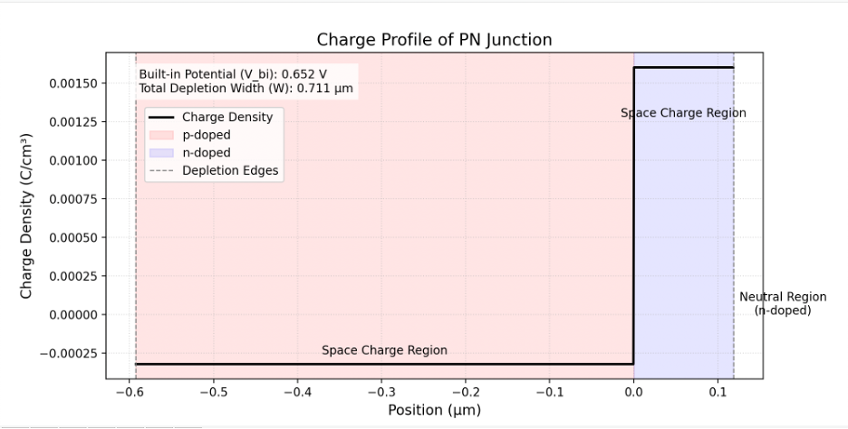
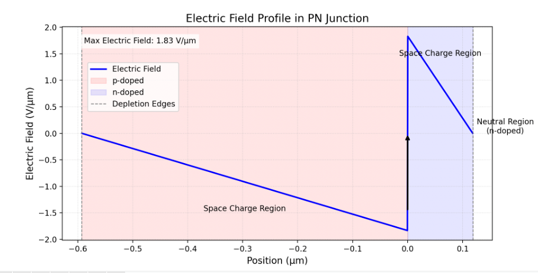
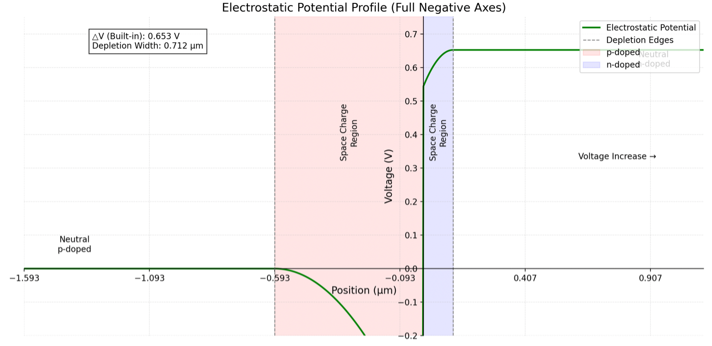
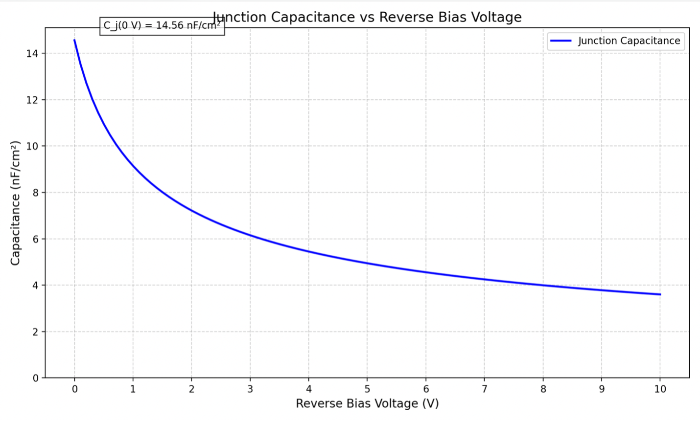
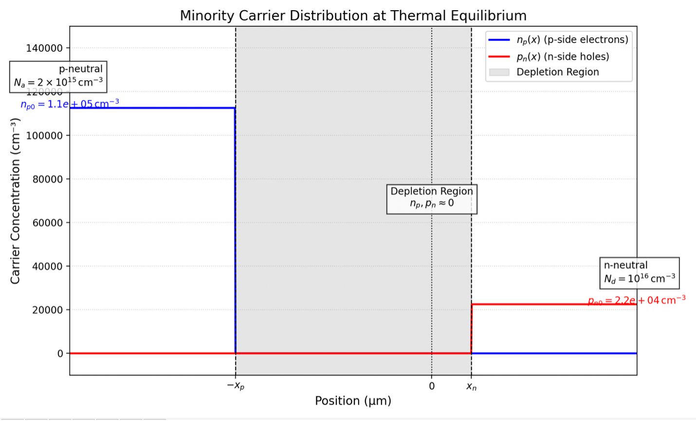
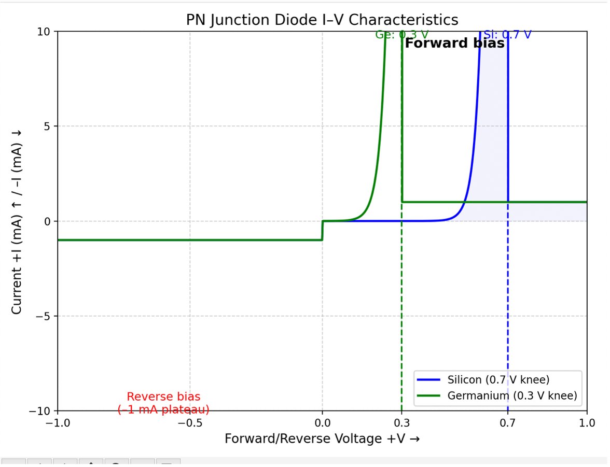
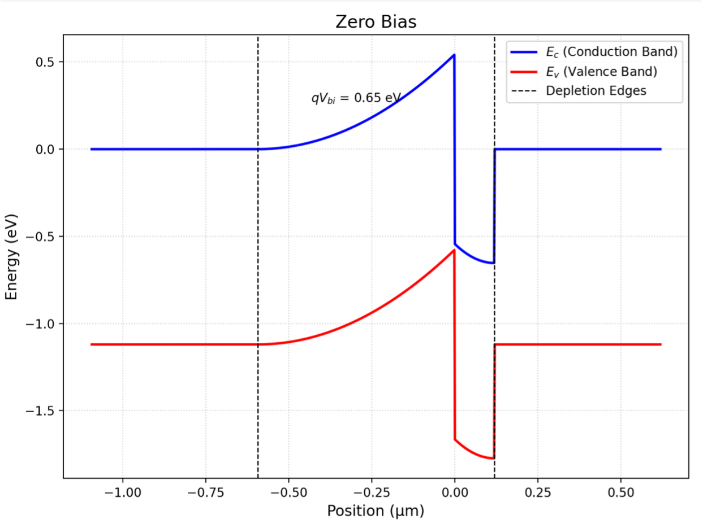
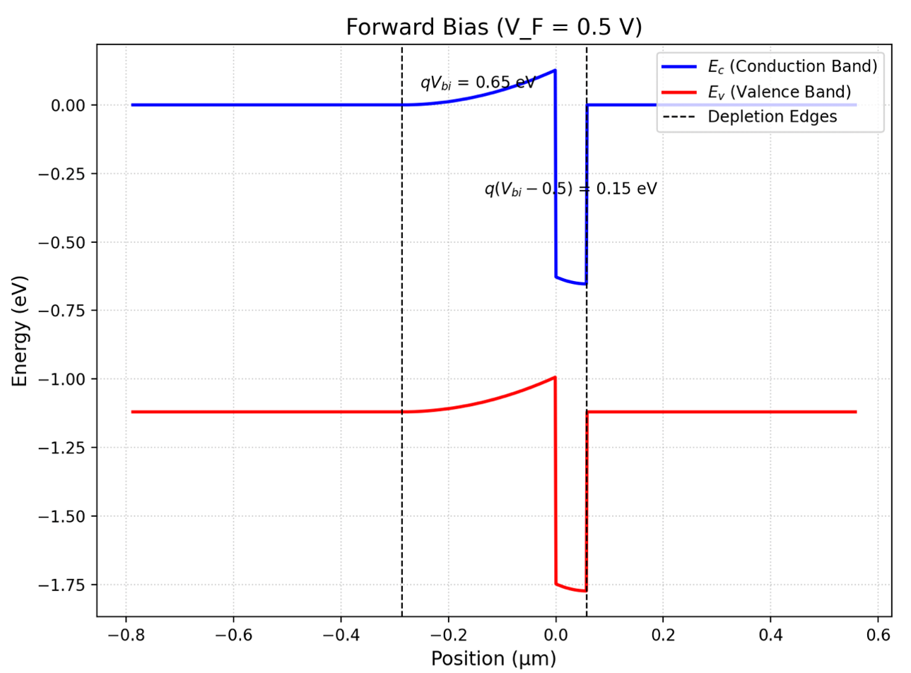
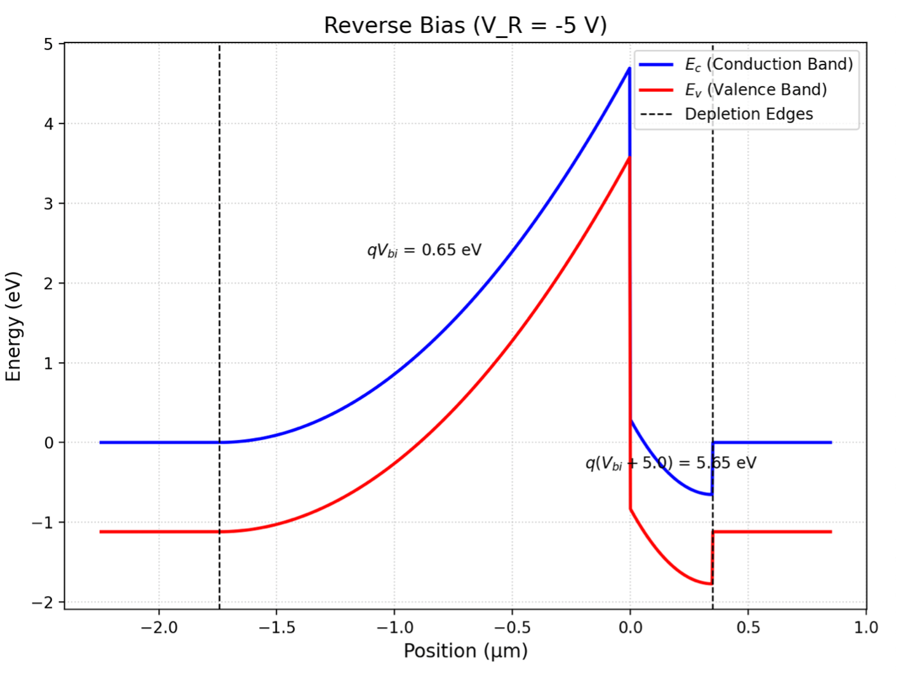

# I-V Characteristics of PN Junctions

## Overview

This repository provides Python scripts to simulate and visualize key properties of a silicon PN junction, including depletion width, charge profile, electric field, electrostatic potential, junction capacitance, minority carrier distribution, I–V characteristics, and energy band diagrams. The parameters used are:

* **Doping concentrations:**

  * P-side: $N_a = 2\times10^{15}\,\mathrm{cm}^{-3}$
  * N-side: $N_d = 1\times10^{16}\,\mathrm{cm}^{-3}$&#x20;
* **Intrinsic carrier concentration:** $n_i = 1.5\times10^{10}\,\mathrm{cm}^{-3}$&#x20;
* **Temperature:** 300 K
* **Permittivity of silicon:** $\varepsilon_s = 11.7\,\varepsilon_0$ (with $\varepsilon_0 = 8.85\times10^{-14}\,\mathrm{F/cm}$)&#x20;

Each script computes analytical expressions derived from depletion approximation and plots results using Matplotlib.

---

## Table of Contents

1. [Requirements](#requirements)
2. [Repository Structure](#repository-structure)
3. [Usage](#usage)
4. [Theoretical Background](#theoretical-background)
5. [Scripts and Descriptions](#scripts-and-descriptions)
6. [Sample Results](#sample-results)
7. [References](#references)
8. [Author](#author)

---

## Requirements

* Python 3.6+
* NumPy
* Matplotlib

Install dependencies via pip:

```bash
pip install numpy matplotlib
```

---

## Repository Structure

```
.
├── charge_depletion.py           # Depletion width & charge profile
├── electric_field.py             # Electric field profile
├── potential.py                  # Electrostatic potential profile
├── capacitance_reverse_bias.py   # Junction capacitance vs. reverse bias
├── minority_carrier.py           # Minority carrier distributions
├── forward_reverse_bias.py       # I–V characteristics (Si & Ge)
├── band_diagram.py               # Energy band diagrams under bias
└── README.md                     # Project overview and instructions
```

---

## Usage

Run each script independently to generate its corresponding plot:

```bash
python3 charge_depletion.py
python3 electric_field.py
python3 potential.py
python3 capacitance_reverse_bias.py
python3 minority_carrier.py
python3 forward_reverse_bias.py
python3 band_diagram.py
```

Each script will display a Matplotlib window; save figures as needed.

---

## Theoretical Background

**Built-in potential ($V_{bi}$)** is calculated via

$$
V_{bi} = \frac{k_B T}{q} \ln\!\Bigl(\frac{N_a\,N_d}{n_i^2}\Bigr),
$$

where $k_B$ is Boltzmann’s constant and $q$ is the elementary charge .

**Depletion width (W)** under zero bias follows

$$
W = \sqrt{\frac{2\varepsilon_s}{q}\Bigl(\frac{1}{N_a}+\frac{1}{N_d}\Bigr)V_{bi}},
$$

partitioned into $x_p$ and $x_n$ on the P and N sides, respectively .

Subsequent sections derive the spatial distributions of charge density $\rho(x)$, electric field $E(x)$, potential $V(x)$, junction capacitance $C_j(V_R)$, minority carrier profiles $n_p(x)$, $p_n(x)$, diode current under forward/reverse bias, and conduction/valence band edges $E_c(x)$, $E_v(x)$ for various applied voltages  .

---

## Scripts and Descriptions

### 1. Charge Depletion (`charge_depletion.py`)

* Computes $V_{bi}$, $W$, $x_p$, $x_n$.
* Plots the space-charge density $\rho(x)$ versus position (μm), highlighting depletion and neutral regions .

### 2. Electric Field (`electric_field.py`)

* Uses Poisson’s equation to derive $E(x)$ across the depletion region.
* Converts to V/μm, annotates maximum field, and visualizes P/N doping regions .

### 3. Electrostatic Potential (`potential.py`)

* Integrates electric field to obtain $V(x)$, plotting full negative axis with shifted spines.
* Annotates built-in potential and depletion boundaries .

### 4. Junction Capacitance (`capacitance_reverse_bias.py`)

* Calculates $C_j(V_R)=\varepsilon_s/W(V_R)$ over 0–10 V reverse bias.
* Converts to nF/cm², plots capacitance drop with bias, and highlights $C_j(0)$ .

### 5. Minority Carrier Distribution (`minority_carrier.py`)

* Evaluates equilibrium minority densities $n_p0$, $p_n0$.
* Plots carrier concentrations outside depletion region, with dashed lines at equilibrium values .

### 6. I–V Characteristics (`forward_reverse_bias.py`)

* Models diode current $I(V)$ using ideal diode equation with knee current limits.
* Simulates both silicon (0.7 V knee) and germanium (0.3 V knee), displaying forward/reverse regions .

### 7. Energy Band Diagram (`band_diagram.py`)

* Computes conduction/valence band edges under zero, forward (+0.5 V), and reverse (–5 V) bias.
* Plots $E_c(x)$ and $E_v(x)$ with annotated band bending .

---

## Sample Results

| Output | Description |
|:---:|:---|
|  | Space-charge density vs. position |
|  | Electric field profile |
|  | Electrostatic potential distribution |
|  | Capacitance vs. reverse bias |
|  | Minority carrier decay profiles |
|  | Diode I–V characteristics (log scale) |
|  | Energy band diagrams under Zero bias |
|  | Energy band diagrams under Forward bias |
|  | Energy band diagrams under Reverse bias |


---

## References

* S. M. Sze & K. K. Ng, *Physics of Semiconductor Devices*, 3rd ed.

---

## Developer

**Abhinav Samudrala**
